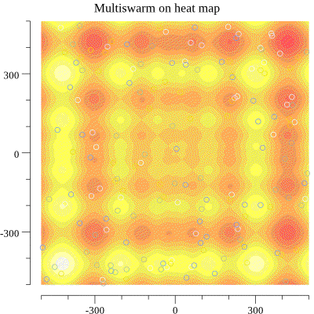

Author: Martin Sadový
Licence: MIT

# (Multi Swarm) Particle Swarm Optimalization with visualization in gif in GO lang

How it works? Classic PSO, but every swarm changes his M best particles with next swarm every N iteration. (where N iterations/(switches+1))
If you use -swarm 1, it is classic PSO. If you use -switches 0, it computes with independent swarms and return the best without potential cooperation.

## How build
```
go get .
go build
```

## Usage:
```
>PSO.exe -h
Usage of PSO.exe:
  -function string
        Switch function will be used (dejong1, schwefel, ackley) (default "dejong1")
  -gif string
        Where save gif simulation? (default "simulation.gif")
  -help
        How can I help you? RTFM!
  -iterations int
        Total iterations per swarm (default 10000)
  -particlesInSwarm int
        Particles in swarm (default 20)
  -pso_c1 float
        Parameter C1 in velocity update (default 2)
  -pso_c2 float
        Parameter C2 in velocity update (default 2)
  -quadraticWorld string
        Write corner points for hypercube, eg. 2D: X_start,Y_start,X_end,Y_end (default "-500,-500,500,500")
  -swarms int
        Count of independent swarms (background is swarm concurrency) (default 4)
  -swichedParticle int
        Switch the best N particles between swarm (default 5)
  -switches int
        Count of switch after N iterations where N = iterations/(switches+1) except last iteration (default 5)
```

*BE AWARE*: switches generates gif slide where rendering can consume a lot of memory and disk usage! If you want a lot of switch use: -gif ""

### Example of output:
```
>PSO.exe -swarms=50 -function schwefel
GBest -837.96577 found on position: 420.97239, 420.96885

>PSO.exe -swarms=1 -iterations 10 -particlesInSwarm 20 -function schwefel
GBest -741.09186 found on position: 393.00000, 416.00000

>PSO.exe -swarms=1 -iterations 40 -particlesInSwarm 20 -function schwefel
GBest -597.53157 found on position: -301.08445, -297.41254

>PSO.exe -swarms=1 -iterations 1000 -particlesInSwarm 20 -function schwefel
GBest -837.90798 found on position: 421.04524, 421.64109

>PSO.exe -swarms=1 -iterations 10000 -particlesInSwarm 20 -function schwefel
GBest -837.96577 found on position: 420.96207, 420.97315

PSO.exe -swarms=1 -iterations 10000 -particlesInSwarm 20 -function dejong1
GBest 0.00082 found on position: 0.02846, -0.00255
```


